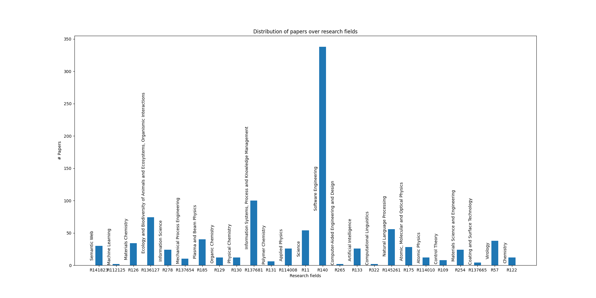
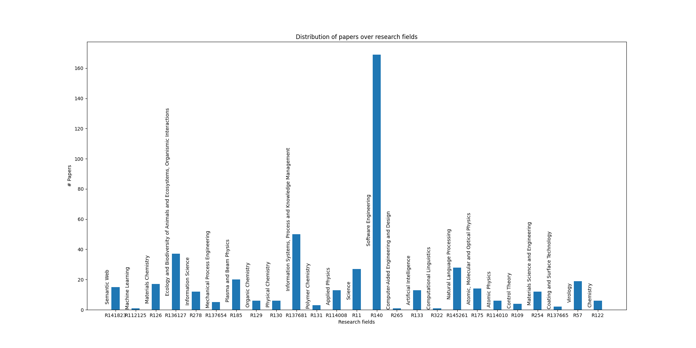
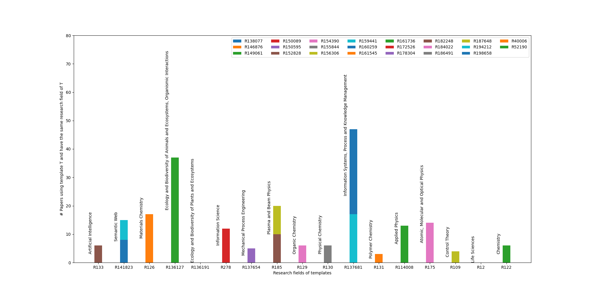
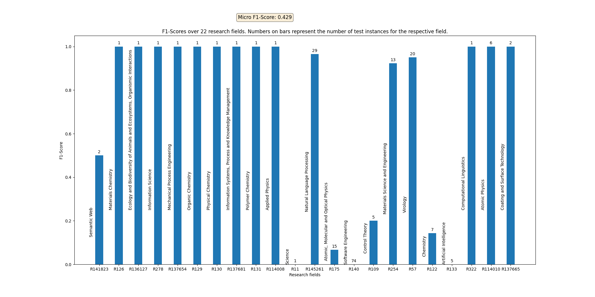
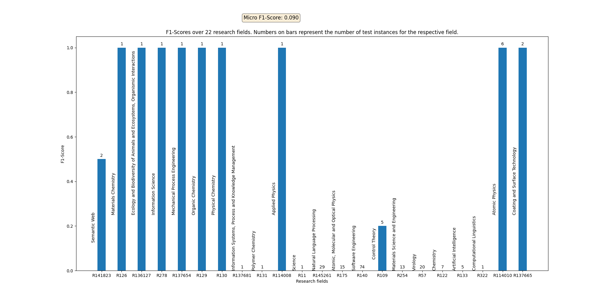
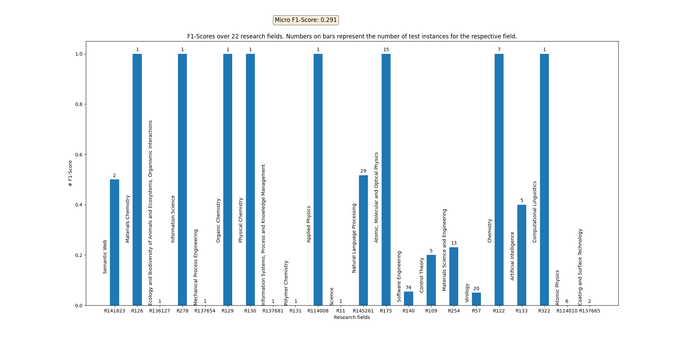
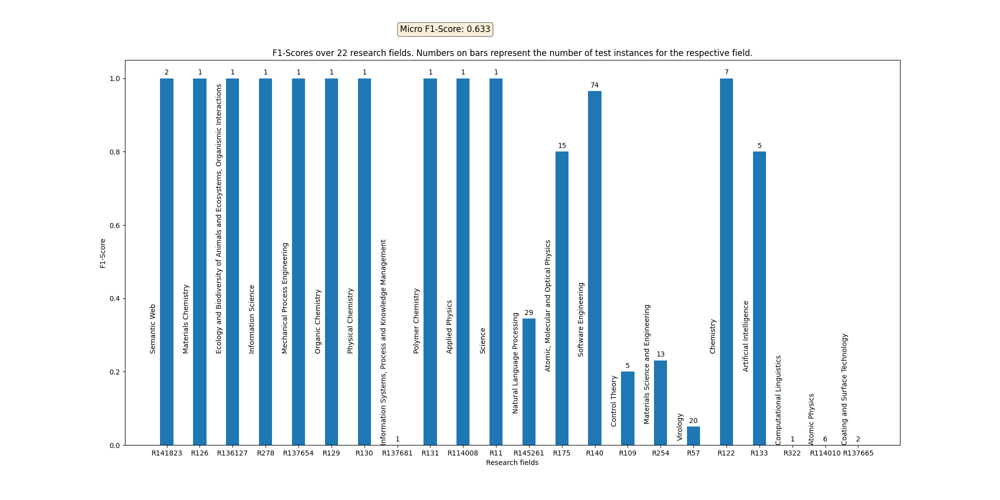

# ORKG-NLP Service Template

## Overview

### Aims
This service aims to foster constructing the ORKG using predefined set of predicates that
are represented by semantic building blocks called **Templates**. This directs ORKG
users to converge towards selecting predicates added by domain experts while not preventing
them from adding new ones / selecting other ones, as the crowdsourcing concept of the 
ORKG suggests.

### Approach
To this end, two approaches are implemented and experimented for this particular service
and their results are shown. For the service integration/production we select the best.

1. [**Elasticsearch (ES)**](https://www.elastic.co/): An index document is represented by {template}-{paper} concatenation.
   In query time, a query represented by a {paper} should result with {template}s. Trained on `data/processed/es_training_set.json`.
2. **[SciBERT](https://aclanthology.org/D19-1371/) NLI (Natural Language Inference)**: A training instance is represented by 
    {premise}-{hypothesis} equivalent to {template}-{paper} pairs. In query time, a hypothesis
    query (paper) should result with entailed {premise}s (templates). Trained on `data/processed/training_set.json`.

We also implemented a ``baseline`` on that the current ORKG-UI depends on, where templates are recommended based
on the ``research field`` that they belong to. In other words, the baseline groups templates by their research field and 
recommends all templates to a query paper that have the same paper's research field. We build the groups depending on
two datasets:

* `baseline`: `data/processed/dataset.json` same dataset used for our approaches (before splitting),
   that has selected templates based on some criteria.
* `baseline_full`: `data/raw/baseline_templates.json` includes all templates in the ORKG.


### Dataset
The dataset is created by fetching templated papers (ORKG papers structured (even partially) using ORKG templates) and untemplated papers
with same (or very similar) distribution as the templated ones. Papers abstracts were fetched from the
[ORKG papers dump](TODO_direct_download_link).

#### Statistics 
> The following statistics are manually summarized based on the output of `src.data.main.py` script.

| Templates | Templated Papers | Neutral Papers | Templates Research Fields | Neutral Research Fields |
|-----------|------------------|----------------|---------------------------|-------------------------|
| 23        | 487              | 487            | 25                        | 25                      |


| \               | Training (supervised) | Validation (supervised) | Training (unsupervised) | Test Set |
|-----------------|-----------------------|-------------------------|-------------------------|----------|
| Entailments     | 351                   | 39                      | 390                     | 92       |
| Contradictions  | 1230                  | 137                     | 0                       | 0        |
| Neutrals        | 351                   | 39                      | 390                     | 97       |
| Total           | 1932                  | 215                     | 780                     | 189      |

#### Plots

| Original                                                                                                                         | Preview                                                                                           |
|----------------------------------------------------------------------------------------------------------------------------------|---------------------------------------------------------------------------------------------------|
| [All papers distribution over research fields](./data/processed/all_papers_research_fields.png)                                  |              |
| [Templated papers distribution over research fields](./data/processed/papers_research_fields.png)                                |                  |
| [Neutral papers distribution over research fields](./data/processed/neutral_papers_research_fields.png)                          |          |
| [Templates distribution over research fields with number of papers](./data/processed/templates_research_fields_intersection.png) |  |

### Evaluation

In the experimental setup we only took the top-1 result of the service response for a fair
comparison, since Elasticsearch always returns so many results that we cannot rely on for
the normalization.

> Note that all approaches are evaluated on `data/processed/test_set.json`

#### Results

| \             | Precision | Recall | F1-Score |
|---------------|-----------|--------|----------|
| Baseline      | 42.8%     | 42.8%  | 42.8%    |
| Baseline_full | 8.9%      | 8.9%   | 8.9%     |
| Elasticsearch | 29.1%     | 29.1%  | 29.1%    |
| SciBERT       | 64.1%     | 62.4%  | 63.2%    |


#### Plots

| Original                                                                                                          | Preview                                                                          |
|-------------------------------------------------------------------------------------------------------------------|----------------------------------------------------------------------------------|
| [Baseline F1-score over research fields](./data/processed/baseline_results.png)                                   |       |
| [Baseline_full F1-score over research fields](./data/processed/baseline_full_results.png)                         |  |
| [ES F1-score over research fields](./data/processed/es_results.png)                                               |             |
| [SciBERT F1-score over research fields](./data/processed/scibert_results.png)                                     |        |

### Limitations 
Training the SciBERT model cannot be done on a CPU since it includes a lot of computations.
Therefore, the notebook ``notebooks/templates_recommendation_training.ipynb`` is provided that
can be run on ``Google Colab`` using a TPU which does take no more than 30 minutes.

## How to Run

### Prerequisites

#### Software Dependencies
* Python version ``^3.7.1``.
* ``docker-compose`` (to run a local ES instance).

#### Hardware Resources
These resources were provided on an instance of Google Colab and were partially used to 
train the SciBERT model. 

* RAM ``12 GB``
* Storage ``107 GB`` 
* Processor ``TPU``

### Cloning the repository

```commandline
git clone https://gitlab.com/TIBHannover/orkg/nlp/experiments/orkg-templates-recommendation.git
cd orkg-templates-recommendation
pip install -r requirements.txt
```

The repository includes the python script `src/main.py` which is a commandline tool responsible for doing all possible
tasks. The tool has the following syntax: 

```commandline
usage: main.py [-h] -t {dataset,train,evaluate,predict}
               [-a {elasticsearch,scibert,baseline,baseline_full}]
               [-trainp TRAINING_SET_PATH] [-testp TEST_SET_PATH] [-q QUERY]
               [-n N_RESULTS]
```

for full documentation, please type

```commandline
python -m src.main -h
```

### Data Creation

The following command will fetch the data from the ORKG, create a dataset, analyse and split it to train and test
sets. The output folders are fixed and cannot be configured, which are:

* `data/raw/` and
* `data/processed/`.

```commandline
python -m src.main -t dataset
```


### Service Retraining

#### Elasticsearch

A docker-compose file is provided to run an Elasticsearch index cluster on your ``localhost:9200``.
```commandline
docker-compose up
python -m src.main -t train -a elasticsearch -trainp ./data/processed/es_training_set.json
```

#### Baseline (full)

```commandline
python -m src.main -t train -a baseline -trainp ./data/processed/dataset.json
```

or 

```commandline
python -m src.main -t train -a baseline_full -trainp ./data/raw/baseline_templates.json
```

#### SciBERT NLI

Use `notebooks/templates_recommendation_training.ipynb` on Google Colab with a TPU runtime instance to train the model.
Please follow the `TODO` instructions there and consider downloading the model with the 
[`transformers.PretrainedModel`](https://huggingface.co/docs/transformers/v4.21.1/en/main_classes/model#transformers.PreTrainedModel)
format to the `models/` directory when you are done, so that it can be used for evaluation.


### Service Evaluation

```commandline
python -m src.main -t evaluate -a <any-approach> -testp ./data/processed/test_set.json
```

### Service Integration

Note that the baseline approach requires a research field ID as a query.

```commandline
python -m src.main -t predict -a <any-approach> -q "your text"
```


## Contribution
This service is developed and maintained by

* Arab Oghli, Omar <omar.araboghli@tib.eu>

under supervision of
* D'Souza, Jennifer <jennifer.dsouza@tib.eu>
* Auer, Sören <auer@tib.eu>

## License
[MIT](./LICENSE)

## References

* [Information Retrieval Service Aspects of the Open Research Knowledge Graph](https://doi.org/10.15488/11834)
* [Elasticsearch](https://www.elastic.co/)
* [SciBERT: A Pretrained Language Model for Scientific Text](https://aclanthology.org/D19-1371/)

